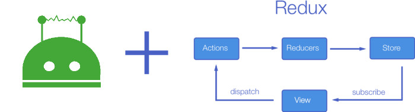

# wechaty-redux

[](https://www.npmjs.com/package/wechaty-redux)
[](https://github.com/wechaty/wechaty-redux/actions?query=workflow%3ANPM)
[](https://github.com/huan/ducks#3-ducksify-extension-currying--api-interface)

Wrap Wechaty with Redux Actions &amp; Reducers for Easy State Management

[](https://github.com/wechaty/wechaty-redux)

> Image Source: [Managing your React state with Redux](https://medium.com/the-web-tub/managing-your-react-state-with-redux-affab72de4b1)

[](https://www.npmjs.com/package/wechaty-redux)
[](https://www.typescriptlang.org/)

## What is Redux

[Redux](https://redux.js.org) is a Predictable State Container for JS Apps

## Why use Redux with Wechaty

To be write...

## What is Ducks

[](https://github.com/huan/ducks#3-ducksify-extension-currying--api-interface)

See [Ducks](https://github.com/huan/ducks)

## Usage

### Install

```sh
npm install wechaty-redux
```

### Wechaty Plugin

```ts
import {
  WechatyRedux,
  api as wechatyApi,
}                     from 'wechaty-redux'
import { Wechaty }     from 'wechaty'
import { Ducks }       from 'ducks'

const bot = Wechaty.instance({ puppet: 'wechaty-puppet-mock' })

const ducks       = new Ducks({ wechaty: wechatyApi })
const store       = ducks.configureStore()
const wechatyDuck = ducks.ducksify('wechaty')

bot.use(WechatyRedux({ store }))

store.subscribe(() => console.info(store.getState()))
store.dispatch(wechatyDuck.actions.ding('redux!'))
```

### Redux Actions

See: [api/actions.ts](src/api/actions.ts)

### Redux Operations

See: [api/operations.ts](src/api/operations.ts)

## Links

### Chatbot in Redux

1. [Building bots with Redux](https://blog.botframework.com/2018/04/12/building-bots-with-redux/)
1. [BotBuilder v3 Node.js bot with Redux state management](https://github.com/microsoft/BotFramework-Samples/tree/master/blog-samples/Node/Blog-Redux-Bot)
1. [🐺 Declarative development for state driven dynamic prompt flow](https://github.com/wolf-packs/wolf-core)
1. [Botbuilder Redux Middleware](https://github.com/howlowck/botbuilder-redux)
1. [Botbuilder Redux Common Package](https://github.com/howlowck/botbuilder-redux-common)

### Redux Tools

1. [Redux DevTools](https://github.com/reduxjs/redux-devtools/tree/master/packages/redux-devtools)
1. [Remote Redux DevTools](https://github.com/zalmoxisus/remote-redux-devtools)
1. [Using Redux DevTools in production](https://medium.com/@zalmoxis/using-redux-devtools-in-production-4c5b56c5600f)
1. [Video - Getting Started with Redux Dev Tools](https://egghead.io/lessons/javascript-getting-started-with-redux-dev-tools)

### Redux Talks

- [Dan Abramov - Live React: Hot Reloading with Time Travel at react-europe 2015](https://www.youtube.com/watch?v=xsSnOQynTHs)
- [Dan Abramov - The Redux Journey at react-europe 2016](https://www.youtube.com/watch?v=uvAXVMwHJXU)
- [Debugging javascript applications in production - Mihail Diordiev](https://www.youtube.com/watch?v=YU8jQ2HtqH4&feature=youtu.be)

### Redux Middleware

- [Redux Middleware](https://redux.js.org/advanced/middleware)
- [React tips — How to create a Redux Middleware Throttle](https://medium.com/@leonardobrunolima/react-tips-how-to-create-a-redux-middleware-throttle-f2908ee6f49e)

## Articles

1. [Setting Up a Redux Project With Create-React-App](https://medium.com/backticks-tildes/setting-up-a-redux-project-with-create-react-app-e363ab2329b8)

## Useful Modules

1. [redux-automata - Finite state automaton for Redux.](https://github.com/mocoding-software/redux-automata)

## History

### v0.2 (Jun 2, 2020)

Initial version. Requires `wechaty@0.40` or above versions.

1. `WechatyRedux` Plugin is ready to use.
1. API follows the [Ducks](https://github.com/huan/ducks) specification.

### v0.0.1 (Apr 19, 2020)

Decide to build a Redux Plugin for Wechaty.

Related Projects:

1. [A library that exposes matrix-js-sdk state via Redux](https://github.com/lukebarnard1/matrix-redux-wrap)
1. [A library for managing network state in Redux](https://github.com/amplitude/redux-query)
1. [How to setup Redux for a REST api](https://medium.com/hackernoon/state-management-with-redux-50f3ec10c10a)
1. [Redux middleware for calling an API](https://github.com/agraboso/redux-api-middleware)

## Author

[Huan LI](https://github.com/huan) ([李卓桓](http://linkedin.com/in/zixia)) zixia@zixia.net

[](https://stackexchange.com/users/265499)

## Copyright & License

- Code & Docs © 2020 Huan (李卓桓) \<zixia@zixia.net\>
- Code released under the Apache-2.0 License
- Docs released under Creative Commons
